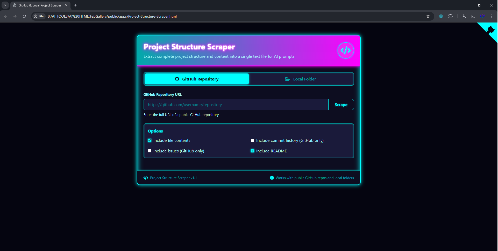

# 💾 Project Structure Scraper Neon  Neon 💾


*A glimpse of the Scraper in action with its dark, neon-themed interface.*

The **Project Structure Scraper** is a web-based utility designed to extract the complete file and folder hierarchy, along with selected file contents, from both public GitHub repositories and local project folders. The output is a single, well-formatted text file, ideal for feeding into AI models (like GPT, Claude, etc.) for code analysis, generating documentation, getting a quick overview of a project's architecture, or for archiving purposes.

## ✨ Features

*   **Dual Mode Operation:**
    *   **GitHub Repository:** Scrape public GitHub repositories by providing their URL.
    *   **Local Folder:** Scrape projects directly from your local file system.
*   **Customizable Scraping:**
    *   **Include File Contents:** Option to include the actual code/text from files (with a 1MB per file limit to prevent browser freezing).
    *   **Include README:** Option to prepend the project's main README file to the output.
    *   *(UI Placeholders)* Options for including commit history and issues (currently UI only, functionality to be implemented).
*   **User-Friendly Interface:**
    *   Clear tab-based navigation for GitHub and Local modes.
    *   Progress bar and status updates during scraping.
    *   Visual preview of selected local folder structure.
    *   Detailed error messages.
*   **Output:**
    *   Generates a single `.txt` file containing the project structure.
    *   Includes metadata like repository/folder name, URL (if applicable), total files, total size, and scrape date.
    *   Clear delimiters for file paths and content.
*   **Modern Aesthetics:**
    *   Dark theme with glowing neon text and borders for a visually appealing experience.
*   **Client-Side Processing:** All operations are performed in the user's browser; no data is sent to any server.
*   **Responsive Design:** Built with Tailwind CSS for adaptability across different screen sizes.

## 🚀 How to Use

1.  **Open the Scraper:**
    *   Simply open the `index.html` file in a modern web browser (Chrome, Edge, Firefox recommended for best compatibility with folder selection).

2.  **For GitHub Repositories:**
    *   Select the **"GitHub Repository"** tab (default).
    *   Enter the full URL of the public GitHub repository (e.g., `https://github.com/username/repository`).
    *   Under **"Options"**:
        *   Check/uncheck "Include file contents" as needed.
        *   Check/uncheck "Include README" to add the repository's README.md at the beginning of the output.
    *   Click the **"Scrape"** button.
    *   Wait for the progress bar to complete. The scraped structure will appear in the "Project Structure" text area.
    *   Click the **"Download"** button to save the `.txt` file.

3.  **For Local Folders:**
    *   Select the **"Local Folder"** tab.
    *   Click the **"Choose folder..."** button. A system dialog will appear.
    *   Select the root folder of the project you want to scrape. A preview of the selected folder structure will appear.
    *   Under **"Options"**:
        *   Check/uncheck "Include file contents" as needed.
        *   Check/uncheck "Include README" to add a `README.md` or `README.txt` found at the root of your selected folder.
    *   Click the **"Scrape Selected Folder"** button.
    *   Wait for the progress bar to complete. The scraped structure will appear in the "Project Structure" text area.
    *   Click the **"Download"** button to save the `.txt` file.

## 📄 Output Format Example

The downloaded `.txt` file will generally look like this:

```text
Repository: owner/repo-name
URL: https://github.com/owner/repo-name
==================================================

📖 README (README.md)
==================================================
This is the content of the README file.
...
==================================================

📁 src/
  📄 main.js
  --- CONTENT START ---
  console.log("Hello, World!");
  --- CONTENT END ---

  📁 components/
    📄 Button.js
    --- CONTENT START ---
    // Button component code
    --- CONTENT END ---

📄 package.json
--- CONTENT START ---
{
  "name": "repo-name",
  "version": "1.0.0"
}
--- CONTENT END ---

==================================================
Total files processed: 3
Total size processed: 1.23 KB
Scraped on: MM/DD/YYYY, HH:MM:SS AM/PM
Use code with caution.
Markdown
🛠️ Technologies Used
HTML5: For the basic structure.
CSS3: For styling, including custom properties for the neon theme.
Tailwind CSS: A utility-first CSS framework for rapid UI development.
JavaScript (Vanilla): For all client-side logic, API interactions, and DOM manipulation.
Font Awesome: For icons.
GitHub API: Used to fetch repository contents when in GitHub mode.
File System Access API (HTML5): Used for local folder selection (webkitdirectory).
🔮 Potential Future Enhancements
Support for .gitignore rules to exclude specified files/folders.
Advanced filtering options (e.g., by file type, exclude specific paths).
Implement GitHub Issues & Commits scraping (currently UI placeholders).
Option for GitHub token input to access private repositories or increase API rate limits.
More output formats (e.g., JSON, Markdown tree).
Configurable file size limit for content inclusion.
Real-time preview updates as options are changed.
💡 Important Notes
GitHub API Rate Limits: When scraping GitHub repositories, you are subject to GitHub's API rate limits for unauthenticated requests. If you scrape many repositories or very large ones frequently, you might encounter temporary blocks.
Large Projects: Scraping very large local folders or GitHub repositories can be resource-intensive for your browser, especially if "Include file contents" is checked.
Browser Compatibility: Local folder selection relies on features that are best supported in Chromium-based browsers (Chrome, Edge) and Firefox.
Enjoy using the Project Structure Scraper!
